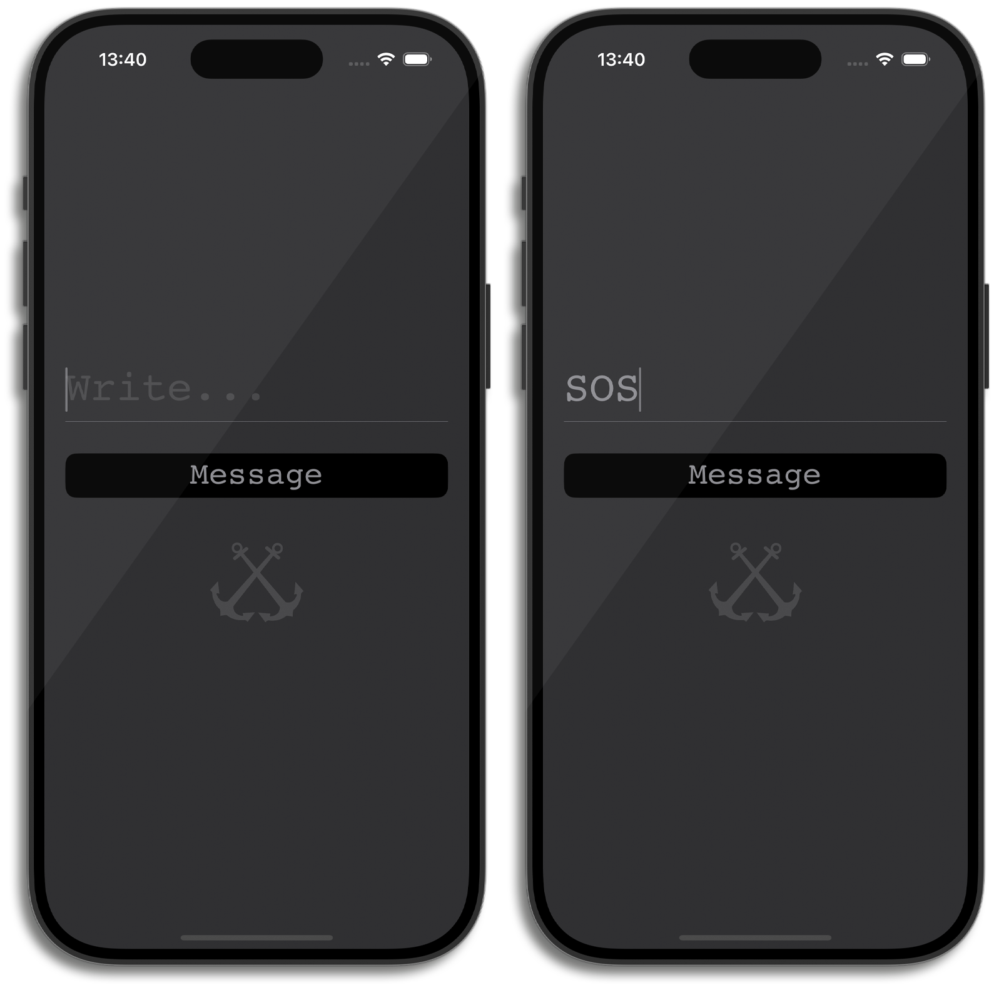

# Morse -- --- ·-· ··· ·


## 🚀 Overview
This app allows you to enter text in English and converts it into Morse code. With a single tap of a button, the screen flashes light and dark colors to visually represent the Morse code sequence.

## ❌ No Storyboards or XIBs ❌
This project is implemented entirely programmatically without using Storyboards or XIB files.

## ⚙️ Technologies:
- **Languages**:
  - Swift 

- **Frameworks**:
  - UIKit
  
## 🚧 Clone:
   ```bash
   git clone https://github.com/alvdalen/Morse
   ```

## 📸 Screenshots (iPhone 16 Pro)

